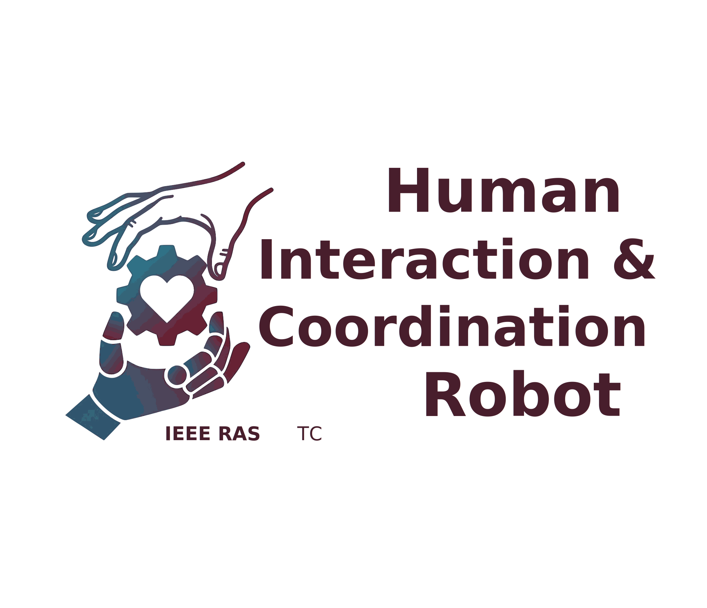

---
hide:
  - navigation
  - toc
---

{ .hric-intro-logo }

# IEEE RAS Technical Committee on Human-Robot Interaction and Collaboration

*Advancing the science and practice of safe, intuitive, and effective interaction between humans and robots.*

## Scope

The scope of the **TC HRI&C** is the development of methods, models, and systems that enable safe, intuitive, and effective interaction between humans and robots — across physical, cognitive, and social dimensions. The committee promotes research, education, and outreach activities bringing together perspectives from robotics, control, perception, learning, human factors, biomechanics, and design.

**Focus areas** include physical human-robot interaction and collaboration (pHRI / pHRC), safety and compliance, human-aware planning and prediction, assistive and wearable robotics, industrial and surgical collaborative robots, social and cognitive HRI, multimodal communication (speech, gesture, gaze, haptics), and trust and ethics in HRI.

## News

- **2026** — TC HRI&C Seminar Series 2026 line-up will be announced. See [Seminars](seminars.md).
- **2026** — Official website launched.

## Connect

[:fontawesome-brands-x-twitter:{ .hric-social-icon } **X / Twitter**](https://x.com/IeeeS40766){ .hric-social-link }
[:fontawesome-brands-linkedin:{ .hric-social-icon } **LinkedIn**](https://www.linkedin.com/in/ieee-ras-tc-hric-14a3b040a/){ .hric-social-link }
[:fontawesome-brands-youtube:{ .hric-social-icon } **YouTube**](https://www.youtube.com/@IEEERASTCHRIC){ .hric-social-link }

The TC HRI&C operates under the [IEEE Robotics and Automation Society](https://www.ieee-ras.org/).
