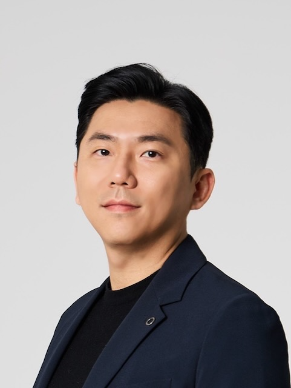
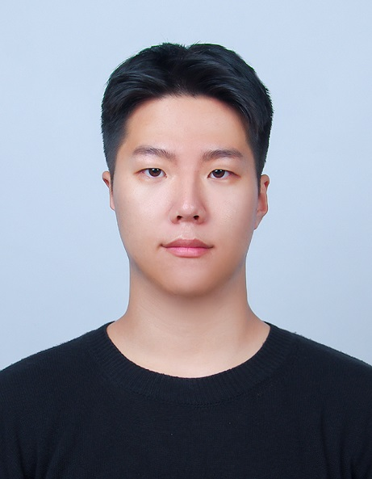
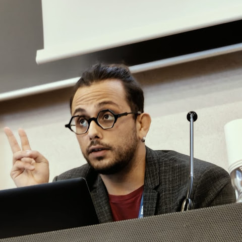
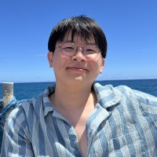

# Members

The IEEE RAS TC on Human-Robot Interaction and Collaboration is led by a team of chairs and student representatives drawn from leading institutions worldwide.

## Technical Committee

-   { .hric-bio-avatar }

    [__Wansoo Kim__](http://harco.hanyang.ac.kr/members/wansoo_kim.html)

    Hanyang University

    [:material-email: wansookim@hanyang.ac.kr](mailto:wansookim@hanyang.ac.kr)

-   { .hric-bio-avatar }

    [__Marta Lorenzini__](https://www.iit.it/it/people-profile/-/people/marta-lorenzini)

    Istituto Italiano di Tecnologia (IIT)

    [:material-email: Marta.Lorenzini@iit.it](mailto:Marta.Lorenzini@iit.it)

-   { .hric-bio-avatar }

    [__Laura Fiorini__](https://www.abrlab.unifi.it/vp-4-people.html)

    Università degli Studi di Firenze

    [:material-email: laura.fiorini@unifi.it](mailto:laura.fiorini@unifi.it)

## Student Representatives

-   { .hric-bio-avatar }

    [__Donggyu Lee__](http://harco.hanyang.ac.kr/members/donggyu_lee.html)

    Hanyang University

    [:material-email: dong2391@hanyang.ac.kr](mailto:dong2391@hanyang.ac.kr)

-   { .hric-bio-avatar }

    [__Marco Vincenzo Maselli__](https://www.linkedin.com/in/mv-maselli/)

    Università degli Studi di Firenze

    [:material-email: marcovincenzo.maselli@unifi.it](mailto:marcovincenzo.maselli@unifi.it)

-   { .hric-bio-avatar }

    [__Hochul Hwang__](https://hchlhwang.github.io)

    University of Massachusetts Amherst

    [:material-email: hochulhwang@umass.edu](mailto:hochulhwang@umass.edu)

